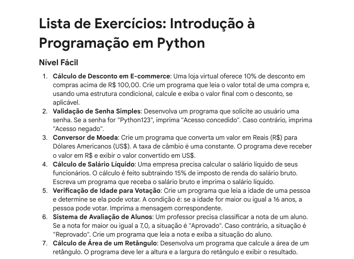
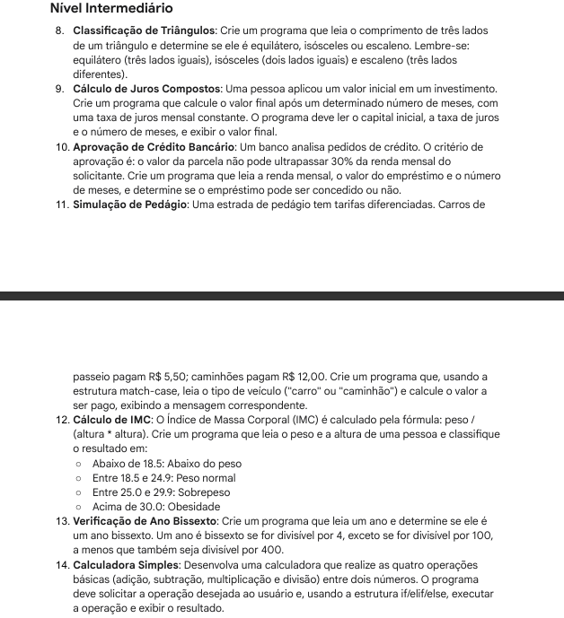
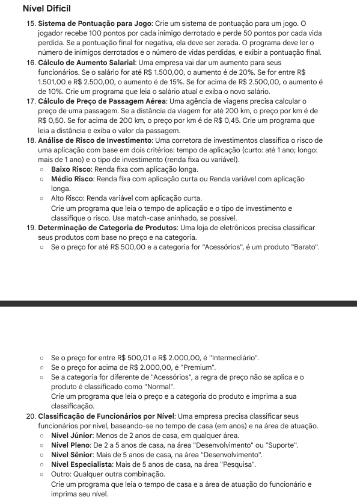

# Lista de Exercícios — Introdução à Programação em Python

Este repositório contém as soluções dos exercícios propostos pelo professor Messias na disciplina **Introdução à Programação**, do curso da **UNIESP**.  
O desafio teve como objetivo praticar conceitos básicos de Python, como entrada e saída de dados, estruturas condicionais, laços e boas práticas de programação.

